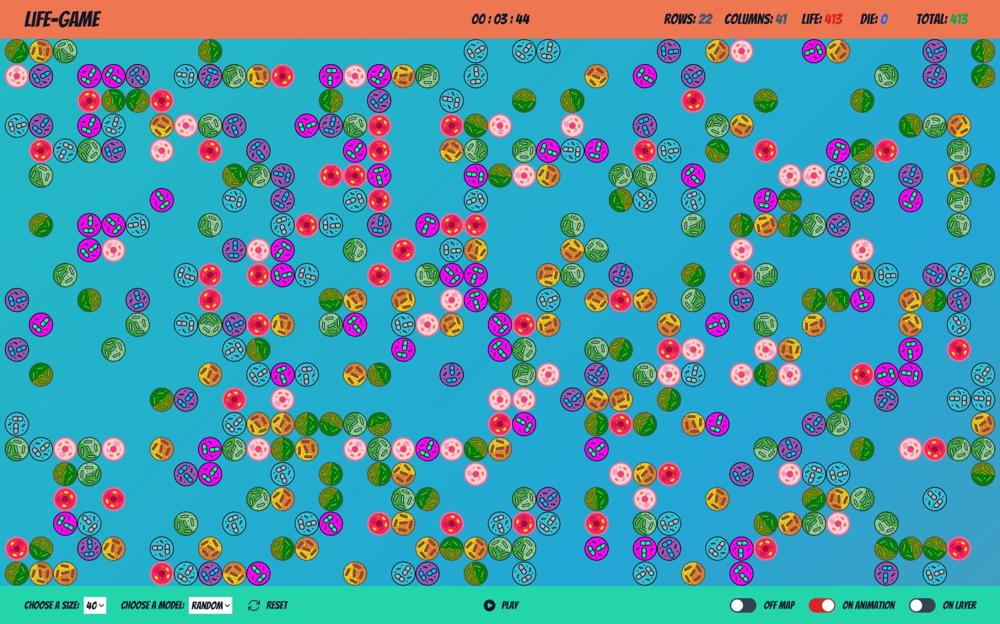

<div align="center">
  
  <h1>Life Game App</h1>
  <p><strong>A modern, interactive Conway's Game of Life cellular automaton built with Next.js and TypeScript.</strong></p>

  <p>
    <a href="https://life-game-nextjs.vercel.app/" target="_blank" rel="noopener noreferrer">
      
    </a>
  </p>

  <p>
    
    
    
    
    
    
  </p>
</div>

---

## 📌 Overview

**Life Game App** is a web-based implementation of John Conway's famous zero-player game, **Conway's Game of Life**. The simulation's evolution is determined entirely by its initial configuration—allowing players to observe complex, emergent behaviors arising from a handful of simple mathematical rules.

Built on **Next.js 13 App Router** and **TypeScript**, this project pairs real-time cellular updates with a responsive UI, state persistence via **Zustand**, and customized grid customization controls.

---

## 🖼️ Preview

<div align="center">
  
</div>

---

## ✨ Features

- 🎮 **Real-time Simulation Controls**: Play, pause, step forward, and reset cycles seamlessly.
- 📐 **Customizable Grid**:
  - Dynamically resize grid cells (e.g., 10px, 20px).
  - Automatically calculates row and column counts based on viewport size.
- 🧬 **Pre-built Cell Models**: Choose from preset configurations and patterns.
- 📊 **Live Telemetry & Metrics**:
  - Generation step counter / simulation clock.
  - Active cell census (Alive vs. Dead vs. Total).
  - Dynamic rows and columns indicators.
- 🎛️ **Visual Display Toggles**:
  - **Map Coordinates**: Display grid cell coordinate indices.
  - **Animations**: Toggle cell state transition animations.
  - **Layer Overlay**: Enable/disable grid borders and cell boundaries.
- ⚡ **Optimized State Management**: Powered by **Zustand** stores for decoupled, lightning-fast rendering cycles.

---

## 📜 Conway's Game of Life Rules

The game takes place on an infinite 2D orthogonal grid of square cells, each in one of two possible states: **alive** or **dead**. Every cell interacts with its eight adjacent neighbors (horizontal, vertical, diagonal).

At each step in time ($t \rightarrow t+1$):

1. **Birth**: Any dead cell with exactly **3 live neighbors** becomes a live cell.
2. **Survival**: Any live cell with **2 or 3 live neighbors** survives into the next generation.
3. **Underpopulation (Exposure)**: Any live cell with **fewer than 2 live neighbors** dies.
4. **Overcrowding**: Any live cell with **more than 3 live neighbors** dies.

| Cell State | Live Neighbors | Next State | Condition |
| :---: | :---: | :---: | :--- |
| Dead ⚪ | 3 | **Alive** 🟢 | **Birth** |
| Alive 🟢 | 2 or 3 | **Alive** 🟢 | **Survival** |
| Alive 🟢 | < 2 | **Dead** ⚪ | **Underpopulation** |
| Alive 🟢 | > 3 | **Dead** ⚪ | **Overcrowding** |

---

## 🛠️ Tech Stack

- **Framework**: [Next.js 13](https://nextjs.org/) (App Router architecture)
- **UI & Components**: [React 18](https://react.dev/)
- **Language**: [TypeScript](https://www.typescriptlang.org/)
- **Styling**: [Tailwind CSS](https://tailwindcss.com/)
- **State Store**: [Zustand](https://github.com/pmndrs/zustand)
- **Deployment**: [Vercel](https://vercel.com/)

---

## 📂 Project Structure

```text
├── app/
│   ├── favicon.ico          # Project icon
│   ├── globals.css          # Global styles & Tailwind directives
│   ├── layout.tsx           # Root layout definition
│   └── page.tsx             # Main entry page
├── components/
│   ├── Button.tsx           # Action button component
│   ├── Cell.tsx             # Individual grid cell renderer
│   ├── CountUp.tsx          # Simulation cycle counter
│   ├── Footer.tsx           # Game controls & configuration panel
│   ├── Header.tsx           # Simulation statistics header
│   ├── Layer.tsx            # Main cell matrix viewport
│   ├── Loader.tsx           # Loading indicator
│   ├── Select.tsx           # Custom select input
│   └── Switch.tsx           # Toggle switch component
├── context/
│   ├── useActionConfig.tsx  # Game controls and cell state store
│   └── useLayerConfig.tsx   # Layer, layout, and visual toggles store
├── helpers/
│   ├── getRulesTransitions.tsx  # Transition rule computations
│   ├── neighboursCells.tsx      # Neighbor detection algorithms
│   └── valuesSelects.tsx        # Preset definitions and sizes
├── hooks/
│   └── useWindowSize.tsx    # Responsive viewport tracking
├── public/
│   └── assets/              # Static SVG models and preview images
└── types/
    ├── Cell.tsx             # Cell interfaces and types
    └── Time.tsx             # Timer configurations
```

---

## 🚀 Getting Started

### Prerequisites

Ensure you have [Node.js](https://nodejs.org/) installed (v18.x or later recommended).

### Installation

1. **Clone the repository:**
   ```bash
   git clone https://github.com/alfonsoj-entwickler/life-game-nextjs.git
   cd life-game-nextjs
   ```

2. **Install dependencies:**
   ```bash
   npm install
   ```

3. **Run the local development server:**
   ```bash
   npm run dev
   ```

4. **Open your browser:**
   Navigate to [http://localhost:3000](http://localhost:3000) to view the application.

---

## 📋 Available Scripts

| Command | Description |
| :--- | :--- |
| `npm run dev` | Starts the Next.js development server at `localhost:3000` |
| `npm run build` | Compiles the production build |
| `npm run start` | Runs the compiled production server |
| `npm run lint` | Runs ESLint to check for code quality and syntax errors |

---

## 👤 Author

**Alfonso J.**

- GitHub: [@alfonsoj-entwickler](https://github.com/alfonsoj-entwickler)
- Email: [alfonsoj.entwickler@gmail.com](mailto:alfonsoj.entwickler@gmail.com)
- Live Project: [life-game-nextjs.vercel.app](https://life-game-nextjs.vercel.app/)

---

## 📄 License

This project is licensed under the terms defined by the author. Contributions and suggestions are always welcome!